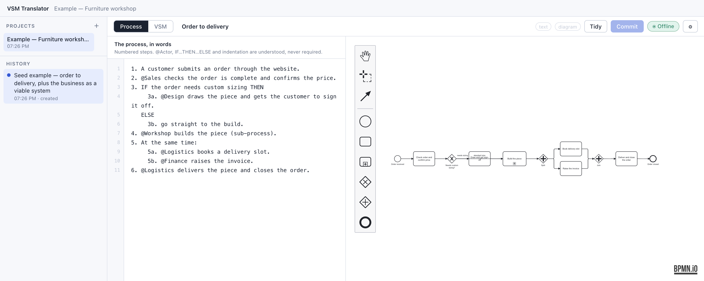
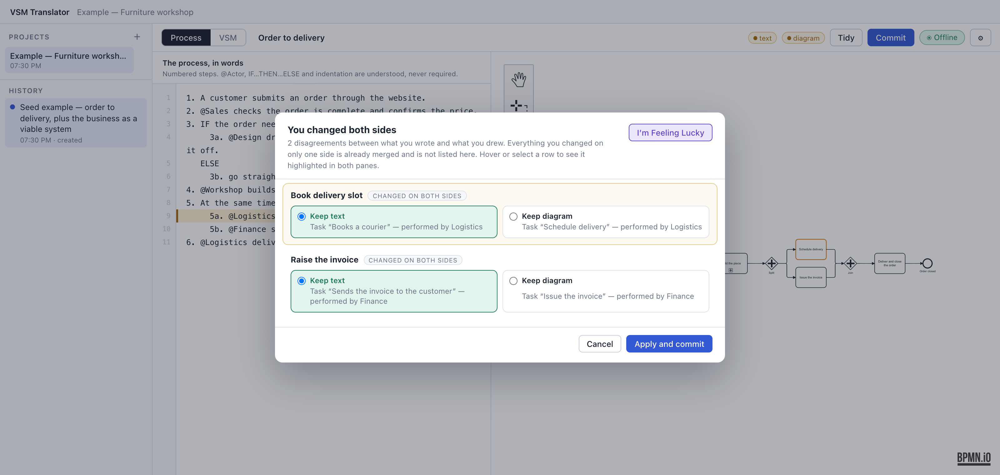
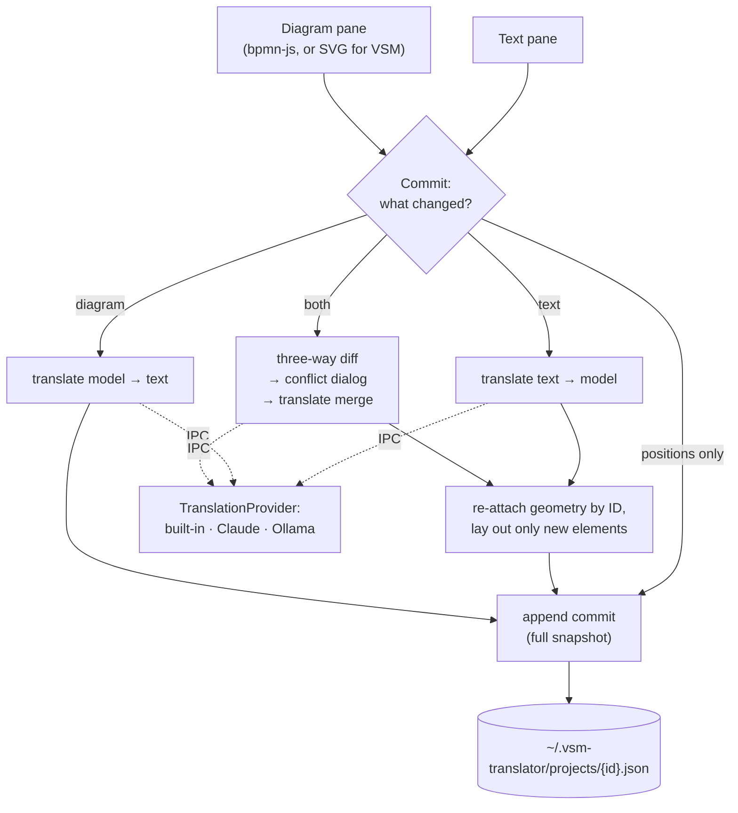

# vsm-translator

A desktop app that keeps a plain-language process description and its BPMN 2.0 diagram in sync in both directions, and does the same for Viable System Model diagrams of an organization.




## Why I built this

In my systems consulting work I model organizations with Stafford Beer's Viable System Model and map their processes as BPMN. People describe how work happens in plain language; a diagram is what you need to analyze it. I kept translating between the two by hand, and the two kept drifting apart. Diagram tools treat the diagram as the truth and documents treat the text as the truth. I wanted a tool where neither side is the source of truth: edit either one, commit, and the other catches up.

## What it does

- Shows two panes, text and diagram. **Commit** translates whichever side changed into the other. A change that only moves boxes is saved without a translation call.
- When both sides changed, opens a conflict dialog with one row per element that the two sides changed differently. Each row offers Keep text, Keep diagram, or a free-text instruction.
- Keeps your layout across re-translation: element IDs are reused, positions are re-attached by ID, and only new elements get placed.
- Nests sub-processes for real. Double-click one to drill in; each level has its own text and diagram, with a breadcrumb back up.
- Has a VSM mode (Systems 1 to 5 and Beer's channels) with the same commit flow. A System 1 unit can be linked to the BPMN process it runs, and double-clicking it opens that process.
- Offers three translators behind one interface: built-in rules (offline, the default with no key), Claude, and a local model through Ollama.
- Keeps an append-only history. Every commit is a full snapshot with a one-line summary, and restoring an old commit adds a new one rather than truncating.
- Links text and diagram on hover. Hovering a line highlights the elements it produced; hovering an element shows the text it came from and a short explainer of the BPMN or VSM concept.

## Use cases

- Mapping a process live during a discovery conversation: type the steps as people describe them, commit, and check the diagram with them on the spot.
- Turning a written SOP into a BPMN diagram, then adjusting the diagram and getting the SOP text back.
- Documenting an organization's structure as a VSM and linking each operating unit to the processes it actually runs.
- Keeping process docs and diagrams in sync as the process changes, editing whichever side is more convenient.

## Quick start

### Requirements

- Node 22.12 or newer. I verified it on Node 26.7.0 with npm 11.19.0. Electron 44 does not install correctly on older Node.
- macOS. I've only run it on macOS 15.8 (Apple Silicon). Electron is cross-platform, but nothing else has been tried.
- Optional: an Anthropic API key, or [Ollama](https://ollama.com) with a model pulled.

### Install and run

```bash
npm ci
```

```bash
npm start
```

`npm start` bundles the Electron main process, starts the Vite dev server for the renderer, and opens the app. The first run downloads the Electron binary, because Electron 44 fetches it on first launch rather than at install. Ctrl-C stops everything. On first launch the app writes an example project (a small furniture workshop) and opens it.

To run the same UI in a browser, with no Electron, at `http://localhost:5273`:

```bash
npm run web
```

In the browser, projects are kept in `localStorage` and only the built-in translator is available.

Type-check and production build:

```bash
npm run typecheck
```

```bash
npm run build
```

### Configuration

| Variable | Required | What it does |
| --- | --- | --- |
| `ANTHROPIC_API_KEY` | No | Enables the Claude translator. Overrides a key saved in Settings. |

The app does not read a `.env` file, so export the variable or prefix the command (`ANTHROPIC_API_KEY=... npm start`). See [`.env.example`](.env.example). Everything else is set in **Settings** (⌘,): which translator to use, the Claude model, and the Ollama endpoint and model. Settings are stored in `~/.vsm-translator/config.json`, written with owner-only permissions. A key entered there is never sent to the renderer; the UI only sees its last six characters.

For Ollama, start it, pull a model, and pick it in Settings. Larger models follow the required JSON structure much more reliably than small ones.

```bash
ollama pull qwen2.5:14b
```

### Running without an API key

With no key, the app starts on the built-in translator and every feature works: commit, conflicts, drill-down, VSM mode and history. The built-in translator reads a light notation. You don't have to use it, but it gets much better results when you do:

```
1. A customer submits an order.
2. @Sales checks the order and confirms the price.
3. IF the order needs custom sizing THEN
     3a. @Design draws it and gets sign-off.
   ELSE
     3b. go straight to the build.
4. @Workshop builds the piece (sub-process).
5. At the same time:
     5a. @Logistics books a delivery slot.
     5b. @Finance raises the invoice.
```

`@Actor` names who does a step, `IF…THEN…ELSE` marks a branch, indentation marks sub-steps, and "at the same time" marks a parallel split. The built-in translator can't interpret loose prose: text without numbering, keywords or indentation becomes a flat chain of steps. It also can't act on a written instruction in the conflict dialog, so it hides that box. **Settings → Test** round-trips a sample through the parser rather than just reporting success.

## How it works



The renderer (React) owns the model: nodes and edges with optional geometry. bpmn-js is a view over that model, not the store. The commit logic is in `src/App.tsx` (`commitProcess` and `commitVsm`). It decides the direction, calls a translator, and hands the result to `src/lib/commit.ts`, which re-attaches geometry and appends the commit. The three-way diff and conflict detection are in `src/model/diff.ts` and `src/model/vsmDiff.ts`, incremental layout is in `src/model/layout.ts`, and BPMN 2.0 XML generation is in `src/model/bpmnXml.ts`.

The translators live in the Electron main process under `electron/translator/`. `index.ts` is the registry. `builtin/` is the rule-based parser and renderer. `anthropic.ts` gets structured output from Claude through a forced tool call, and `ollama.ts` uses Ollama's JSON-schema-constrained output. The two model-based adapters share `prompts.ts` and `shape.ts`. The renderer reaches them over IPC (`electron/preload.ts`, `electron/main.ts`). In browser mode, `src/lib/browserBridge.ts` stands in, using `localStorage` and the built-in translator.

## Design decisions

**Neither pane is the source of truth.** Commit checks what changed since the last commit (the text, the diagram's structure, or only its geometry) and translates in that direction. This matches how I actually work: sometimes I'm writing and sometimes I'm drawing. The cost is that when both sides change, the app has to run a three-way diff against the last commit and involve you. The commit path in `App.tsx` is the most intricate code in the project.

**Conflicts are per difference, not per document.** A change made on only one side is treated as the answer and merged without asking. Only elements both sides changed differently reach the dialog, and each gets its own choice plus an optional written instruction ("call it 'QA gate' and put it after the split"). The cost is an extra translation call to merge. Instructions only work with Claude or Ollama, and VSM conflicts are resolved locally by a deterministic pick, so they take no instructions.

**Layout survives re-translation.** Each translation call is given the current model and asked to reuse element IDs for anything that survives. Geometry is then re-attached by ID, and only elements without a position are placed, next to whatever they connect to. With the built-in translator, re-committing the example project's text reuses all 11 element IDs and moves none of them. The cost is a dependency on the translator reusing IDs: if a model renames an element instead of keeping its ID, the app treats it as new and places it automatically. **Tidy** does a full re-layout when you want one.

**Three translators behind one interface.** Everything above the adapters talks to a `TranslationProvider`, and capability flags (`offline`, `needsApiKey`, `supportsInstructions`) let the UI adapt without knowing which one is active. The built-in translator means the app works with no key and nothing leaves the machine. Ollama gives real language understanding that still runs fully local. Having all three lets me run the same input through each and compare how they behave. The cost is that prompts and schemas have to work for both Claude and much smaller local models, and the rule-based translator stays well behind on loose prose.

**History is append-only and stores full snapshots.** Every commit stores the whole project content with a one-line summary and a list of changes. Restore appends a new commit, so nothing is ever lost and stepping back and forth is trivial. The cost is that project files grow with every commit; the example project is about 42 KB with a single commit.

**Local-first, as plain JSON files.** Each project is one pretty-printed JSON file in `~/.vsm-translator/projects/`, written atomically (write, then rename). There are no accounts and no cloud, so client material stays on the machine unless you choose the Claude translator, which sends the text to the Anthropic API. The cost is no sync and no collaboration.

## Limitations and known issues

- It covers a BPMN subset: start and end events, tasks, sub-processes, exclusive and parallel gateways, and sequence flows. There are no pools or swimlanes.
- There's no `.bpmn` import or export yet. `src/model/bpmnXml.ts` already generates BPMN 2.0 XML with diagram layout (that's what bpmn-js loads), so export would mostly mean writing that string to a file.
- With the built-in translator, hand-written edge labels other than yes/no aren't carried into the text, so a re-commit resets them. It links a System 1 unit to a process only when their names match, and its diagram-to-text output is plainer than a model's.
- There are no automated tests. I verified this release by hand: clean install, typecheck, build, a dev-mode boot, and a script exercising the built-in translator.
- I've only run it on macOS. `npm run package` builds an unsigned macOS `.app` with electron-builder (fetched through `npx`); I haven't re-checked it for this release.
- The renderer ships as a single 850 KB chunk, and Vite warns about it.
- `npm audit` flags dev-only dependencies: Vite and esbuild (dev server issues), and undici, which Electron's downloader uses. Production dependencies report no vulnerabilities.

## Project status

Personal project, paused. Last meaningful change: August 31, 2026.

## Built with

Electron 44, React 18, TypeScript, bpmn-js 17, Vite 5, esbuild, Zod, the Anthropic TypeScript SDK, and the Ollama HTTP API. Designed by Matt Burke; built with Claude Code.

Related projects: [lenswork](https://github.com/more-reese/lenswork) (one case, eight reasoning lenses) and [substrate](https://github.com/more-reese/substrate) (plain-English modeling with a versioned structured graph).

## License

MIT. See [LICENSE](LICENSE).
